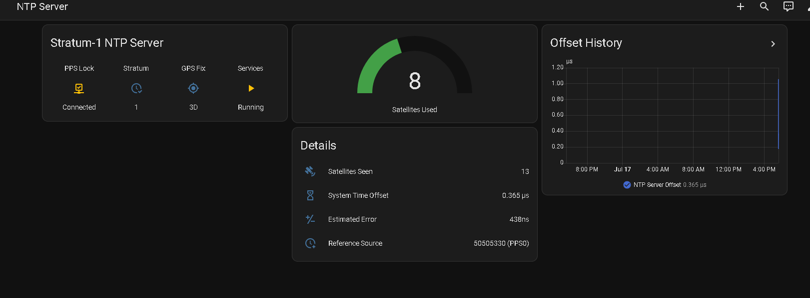

# Raspberry Pi Stratum-1 NTP Server — Interactive Installer

An interactive, idempotent installer that turns a Raspberry Pi with a GPS
module into a GPS/PPS-disciplined **Stratum-1 NTP server**, plus `gpstool`,
a small status menu for checking the server at a glance.

This project automates the excellent step-by-step guide by
**[domschl/RaspberryNtpServer](https://github.com/domschl/RaspberryNtpServer)** —
all credit for the original research, wiring diagrams and configuration
recipes goes there. Read that guide for hardware selection, wiring and
background; use this installer to skip the manual configuration work.

## What the installer does

Run `sudo ./install.sh` and answer a few questions — everything below is
handled automatically:

1. **GPS connection** — choose USB or serial/UART from a menu. USB devices
   (`/dev/ttyACM*`, `/dev/ttyUSB*`) are auto-detected and offered as a list;
   for serial connections the login console on the UART is disabled via
   `raspi-config` (and on a Pi 3 the PL011/Bluetooth conflict is resolved).
2. **PPS signal** — asks for the GPIO pin (default 4), adds the `pps-gpio`
   overlay to `config.txt` and the required kernel modules.
3. **Packages** — installs `gpsd`, `gpsd-clients`, `chrony`, `pps-tools`.
4. **gpsd** — writes `/etc/default/gpsd` for your device and starts the
   service; disables `systemd-timesyncd` so it doesn't fight with chrony.
5. **chrony** — adds the PPS and GPS refclocks, asks for the initial
   GPS offset and the client network to `allow`, and installs a udev rule
   so the unprivileged `_chrony` user can read `/dev/pps0`.
6. **Optional 4×20 I2C LCD display** — installs the upstream *chronotron*
   status display as a systemd service. Hardware is picked from a menu
   (standard PCF8574 @ 0x27 / Adafruit MCP23008 @ 0x20 / custom), backlight
   schedule and UTC display are configurable. The display software is
   fetched from the upstream repository automatically.
7. **gpstool** — installs the status menu to `/usr/local/bin/gpstool`.
8. **Optional Home Assistant status exporter** — a tiny web service that
   publishes the server's health as JSON for Home Assistant (see
   [Home Assistant integration](#home-assistant-integration)).

Safety properties:

- **Idempotent** — safe to re-run; config lines are only appended when
  missing, so answering wrong once and re-running with the right answers
  simply fixes the system.
- **Backups** — every modified system file is backed up first as
  `<file>.bak-<timestamp>`.

## Requirements

- Raspberry Pi 3, 4 or 5 (the script detects the model and adapts).
- Raspberry Pi OS **Bookworm** or **Trixie** (64-bit recommended).
- A GPS module with a **PPS output** wired to a GPIO pin (default GPIO 4),
  connected via UART (GPIO 14/15) or USB, and an **active GPS antenna**
  with sky view. See the
  [upstream hardware guide](https://github.com/domschl/RaspberryNtpServer#requirements---hardware)
  for module recommendations and wiring diagrams.

## Usage

```bash
git clone https://github.com/aGGreSSiv/RaspberryNtpServer-installer.git
cd RaspberryNtpServer-installer
sudo ./install.sh
```

Answer the prompts, reboot when asked, then check the result:

```bash
gpstool
```

## gpstool

`gpstool` is a one-keystroke menu around the diagnostic commands from the
upstream guide:

```
======================================================
  gpstool - GPS / PPS / NTP server status menu
======================================================

  GPS
   1) cgps            - live GPS view: fix status, satellites in use,
                        signal strength, position (quit with 'q')
   2) gpsmon          - low-level GPS monitor with raw NMEA sentences

  PPS
   3) ppstest         - watch the pulse-per-second signal on /dev/pps0

  NTP / chrony
   4) chronyc tracking    - server stratum, reference source, precision
   5) chronyc sources     - all time sources; '#* PPS0' means stratum 1
   6) chronyc sourcestats - source statistics for offset tuning

  General
   7) service status  - systemd status of gpsd and chrony
   8) health summary  - one-shot overview: fix, satellites, PPS, stratum
```

The **health summary** answers "is everything working?" in one screen:

```
=== Quick health summary ===

GPS fix      : 3D FIX
Satellites   : 09 used / 12 seen
PPS signal   : OK (pulses arriving on /dev/pps0)
NTP stratum  : 1  (reference: 50505330 (PPS0))
Time source  : GPS PPS locked - server is running as STRATUM 1
Services     : gpsd=active chrony=active
```

It parses the raw NMEA stream rather than gpsd's SKY reports, so satellite
counts work in every state — even indoors without an antenna.

## Verifying stratum 1 after installation

Once the antenna has sky view and the GPS gets a fix:

1. `gpstool` → option 1 (`cgps`) should show **3D FIX**.
2. Option 3 (`ppstest`) should print one `assert` line per second.
3. Option 5 (`chronyc sources`) should show `#* PPS0` (locked).
4. Option 4 (`chronyc tracking`) should show `Stratum : 1`.

If PPS stays unusable (`#?`) although the fix is fine, tune the GPS offset:
run option 6 (`sourcestats`), read the `Offset` column of the GPS row,
write it (in seconds) into the `refclock SHM 0 ... offset <value>` line of
`/etc/chrony/chrony.conf` and restart chrony. Details in the
[upstream guide](https://github.com/domschl/RaspberryNtpServer#synchronizing-the-offset-between-serial-time-information-and-pps).

## Home Assistant integration

The optional **status exporter** (installer step 8) lets you watch the NTP
server live from a Home Assistant dashboard:



### How it works

The exporter is a small dependency-free Python service
(`/usr/local/bin/ntp-status-exporter`, systemd unit `ntp-status-exporter`)
that runs unprivileged on the Pi and serves on port **9550**:

- `http://<ntp-server-ip>:9550/status.json` — machine-readable status:

  ```json
  {"fix": "3D", "sats_used": 8, "sats_seen": 13, "stratum": 1,
   "reference": "50505330 (PPS0)", "offset_s": -4.4e-07,
   "pps_locked": true, "est_error": "409ns",
   "gpsd": "active", "chrony": "active", "updated": 1784297857}
  ```

- `http://<ntp-server-ip>:9550/` — a small auto-refreshing status page
  (handy on a phone, or in a Home Assistant *Webpage* card).

Home Assistant **pulls** this JSON with its built-in
[`rest` integration](https://www.home-assistant.io/integrations/rest/) —
nothing on the Pi needs to know about Home Assistant, no broker, no token.

### Setup (change only the IP)

**1.** Add this to your Home Assistant `configuration.yaml` and replace
`192.168.1.2` with your NTP server's IP — that is the only edit needed:

```yaml
rest:
  - resource: http://192.168.1.2:9550/status.json
    scan_interval: 30
    sensor:
      - name: "NTP Server GPS Fix"
        unique_id: ntpserver_gps_fix
        icon: mdi:crosshairs-gps
        value_template: "{{ value_json.fix }}"
      - name: "NTP Server Satellites Used"
        unique_id: ntpserver_sats_used
        icon: mdi:satellite-variant
        state_class: measurement
        value_template: "{{ value_json.sats_used }}"
      - name: "NTP Server Satellites Seen"
        unique_id: ntpserver_sats_seen
        icon: mdi:satellite-variant
        state_class: measurement
        value_template: "{{ value_json.sats_seen }}"
      - name: "NTP Server Stratum"
        unique_id: ntpserver_stratum
        icon: mdi:clock-check-outline
        value_template: "{{ value_json.stratum }}"
      - name: "NTP Server Reference"
        unique_id: ntpserver_reference
        icon: mdi:clock-star-four-points-outline
        value_template: "{{ value_json.reference }}"
      - name: "NTP Server Offset"
        unique_id: ntpserver_offset
        icon: mdi:timer-sand
        unit_of_measurement: "µs"
        state_class: measurement
        value_template: >-
          {{ (value_json.offset_s * 1000000) | round(3)
             if value_json.offset_s is not none else none }}
      - name: "NTP Server Estimated Error"
        unique_id: ntpserver_est_error
        icon: mdi:plus-minus-variant
        value_template: "{{ value_json.est_error }}"
    binary_sensor:
      - name: "NTP Server PPS Lock"
        unique_id: ntpserver_pps_lock
        device_class: connectivity
        value_template: "{{ value_json.pps_locked }}"
      - name: "NTP Server Services OK"
        unique_id: ntpserver_services_ok
        device_class: running
        value_template: >-
          {{ value_json.gpsd == 'active' and value_json.chrony == 'active' }}
```

**2.** Reload REST entities (Developer Tools → YAML → *RESTful entities
and notify services*) or restart Home Assistant.

**3.** Create a new dashboard (e.g. *NtpServer*), open its **raw
configuration editor** and paste — no edits needed, the entity ids are
derived from the sensor names above:

```yaml
views:
  - title: NTP Server
    path: ntpserver
    icon: mdi:satellite-uplink
    cards:
      - type: glance
        title: Stratum-1 NTP Server
        entities:
          - entity: binary_sensor.ntp_server_pps_lock
            name: PPS Lock
          - entity: sensor.ntp_server_stratum
            name: Stratum
          - entity: sensor.ntp_server_gps_fix
            name: GPS Fix
          - entity: binary_sensor.ntp_server_services_ok
            name: Services
      - type: gauge
        entity: sensor.ntp_server_satellites_used
        name: Satellites Used
        min: 0
        max: 20
        severity:
          red: 0
          yellow: 4
          green: 6
      - type: entities
        title: Details
        entities:
          - entity: sensor.ntp_server_satellites_seen
            name: Satellites Seen
          - entity: sensor.ntp_server_offset
            name: System Time Offset
          - entity: sensor.ntp_server_estimated_error
            name: Estimated Error
          - entity: sensor.ntp_server_reference
            name: Reference Source
      - type: history-graph
        title: Offset History
        hours_to_show: 24
        entities:
          - sensor.ntp_server_offset
```

Done — if the server is healthy you should see *PPS Lock: Connected*,
*Stratum: 1* and *GPS Fix: 3D*. Since the sensors are regular Home
Assistant entities, you also get history graphs for free and can build
automations on them (e.g. notify when `binary_sensor.ntp_server_pps_lock`
turns `off`).

### Installing the exporter manually

If you skipped step 8 during installation:

```bash
cd RaspberryNtpServer-installer
sudo install -m 755 ha/ntp-status-exporter /usr/local/bin/
sudo cp ha/ntp-status-exporter.service /etc/systemd/system/
sudo sed -i "s/^User=.*/User=$USER/" /etc/systemd/system/ntp-status-exporter.service
sudo systemctl daemon-reload
sudo systemctl enable --now ntp-status-exporter
curl http://localhost:9550/status.json
```

## Tested on

Verified end-to-end (multiple full runs, including re-runs on an already
configured system):

- Raspberry Pi 4 Model B Rev 1.4, Raspberry Pi OS **Trixie**
  (Debian 13, kernel 6.18, 64-bit)
- chrony 4.6.1, gpsd 3.25
- u-blox NEO-6 class GPS module on `/dev/ttyS0` (UART), PPS via GPIO,
  confirmed reaching **stratum 1 with an estimated error in the
  nanosecond range**
- Home Assistant status exporter + dashboard recipe

Not yet tested on real hardware (code paths exist but feedback is
welcome): USB-connected GPS modules, the optional LCD display step,
Raspberry Pi 3 and Pi 5 specifics, Bookworm.

## Credits

- [Dominik Schlösser (domschl)](https://github.com/domschl) —
  [RaspberryNtpServer](https://github.com/domschl/RaspberryNtpServer), the
  guide this installer implements, and the *chronotron* LCD display
  software installed by step 6.

## License

MIT — see [LICENSE](LICENSE). The optional LCD display software fetched
from the upstream repository is licensed under the upstream project's
terms.
